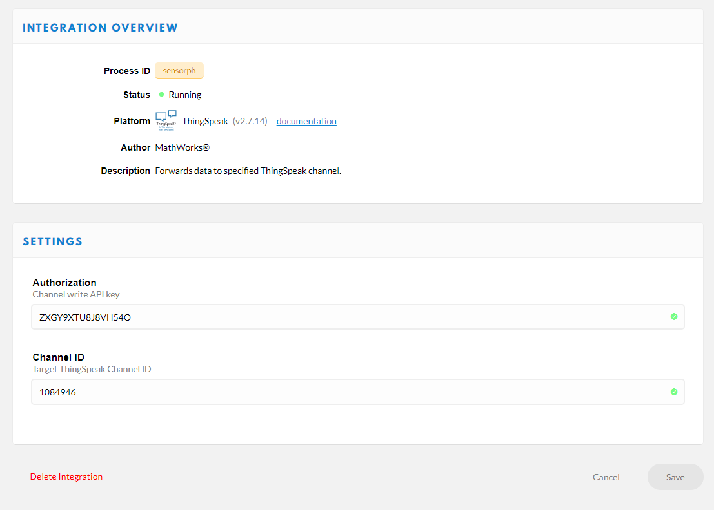
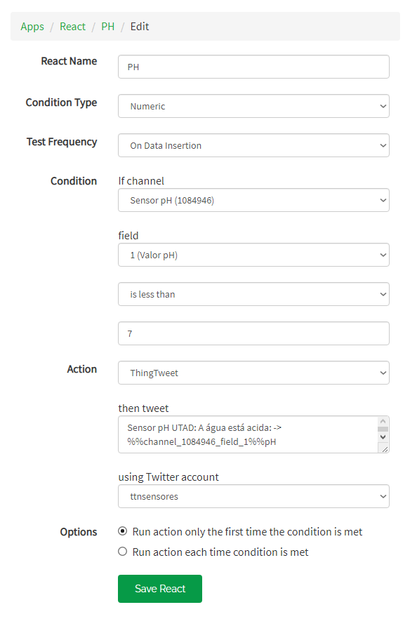

# Sensor pH

> Para mais fácil leitura deste ficheiro, usar o vscode (ou similar) e colocar em modo "__preview__".

Este projeto foi desenvolvido no ambito:

__Cadeira:__ `Intrumentação e Sensores`

__Curso:__ [`Mestrado Integrado Engenharia Eletrotécnica e de Computadores`](https://www.utad.pt/estudar/cursos/engenharia-eletrotecnica-e-de-computadores/)

__Universidade:__

<div style="width:200px;">

[](https://www.utad.pt)

</div>

## Introdução

Pretende-se com este projeto estudar o que são sensores, e também, o que vem a ser o protocolo LoRa. Para tal, vamos simular uma situação real onde se visa saber o pH da água.

Para realizar essa tarefa vamos usar:

- Medir o caudal
  - [Arduino MKR Wan 1310]( https://store.arduino.cc/mkr-wan-1310)
  - Um sensor improvisado (pretendia-se desenvolver uma solução real, mas devido ao Covid-19 essa tarefa ficou adiada)
- Para armazenar e apresentar os dados
  - [ThingsSpeak]( https://thingspeak.com)
  - [Twitter - @TTNSensores_UTAD]( https://twitter.com/ttnsensores) – usado para emitir “alertas”
- Para realizar a interligação entre o sensor e a “base de dados”
  - Protocolo de comunicação `LoRa`
  - LoRaWan network: [The Things Network]( https://www.thethingsnetwork.org/)

## Realização do projeto

Este projeto foi realizado em 4 partes, sendo elas:

- Obter o EUI da Placa e registo da mesma na plataforma _The Things Network_.
- Realizar as Medições
- Enviar os dados obtidos para a plataforma _The Things Network_.
- Integração do _The Things Network_ com o _ThingsSpeak_.

## Obter o EUI e registo da placa no _The Things Network_

## Obter o EUI

O código necessário para essa tarefa esta na pasta `get_eui`.

__Resultado:__

```plan
Your device EUI is: 70B3D57ED002BDB3
```

## Register Devices

__Procedimento:__

- Entrar em `Applications` e selecionar a aplicação pertendida.
- Em `Devices` clique em `register device`
- Preencher os campos da figura abaixo:

<div style="width:550px;">


</div>

```plan
Application ID: sensorph
Device EUI:70B3D57ED002BDB3
```

__Resultado:__

```js
const char *appEui = "70B3D57ED002BDB3";
const char *appKey = "ABE4C6BD14B088059BC3821BFA09536F";
```

## Medições

O código encontra-se nos ficheiros `Sensor_pH.ino` e `arduino_secrets.h`

Como não tenho sensor o meu estudo foi baseado neste sensor:
[ph sensor Arduino, how do ph sensors work, application of ph meter, ph sensor calibration](https://l.facebook.com/l.php?u=https%3A%2F%2Fwww.electroniclinic.com%2Fph-sensor-arduino-how-do-ph-sensors-work-application-of-ph-meter-ph-sensor-calibration%2F%3Ffbclid%3DIwAR0yZ8gWZA3pGury7-Da0lxKvcQJ_ngAyi7NTKs2I3Bqw4DwT8Ys7A-4b6g&h=AT0s3DiNV5qM0nEPs7Pb15BrJRur8h-_yhr4MnEKi-5SiwkrJ_SL-0CPaXKASustfwJ_gYqCiBGgjp7fn1pInczWnbPk2SmgcEw0kuX-J5yZeA4h3bJWWbrkiIgikMO8QWAQqA)

### Obter valor

Apresentação das partes mais importantes do código e uma breve explicação de cada uma.

```c
  // Processamento da leitura - Calculo da media de ph
  voltage = analogRead(A0);
  avgV = avgV * 0.6 + voltage * 0.4;
```

## Enviar os dados para o _The Things Network_

### Enviar dados

O código encontra-se nos ficheiros `Sensor_PH.ino` e `arduino_secrets.h`

```c
 // Enviar valores para "the network of things" de minuto a minuto (60000ms)
  if (millis() - timeUpload > 60000)
  {

    // Tratamento de dados
    int aux = (int)avgV * (5.0 / 1023.0) * 3.5 * 10 + 0.55; 
    txBuffer[0] = aux & 0xff;

    // Envio de dados
    int err;
    modem.beginPacket();
    modem.write(txBuffer);
    err = modem.endPacket(true);

    // Redefinir temporizador
    timeUpload = millis();
  }
```

## Payload Formats

__Procedimento:__

- Selecionar o projeto em causa no _The Things Network_
- Selecionar `Payload Formats` e editar a função `Decoder`

#### Função Decode

```js
function Decoder(bytes, port) {
  var decoded = {};
  
  if (port === 1) decoded.ph = ((bytes[0]) / 10).toFixed(1);

  return{
    field1:decoded.ph
  }
}
```

### Teste do Payload

__pH:__ 65

```plan
65
```

### Resultado

__Valor previsto:__ 10.1

```json
{
  "field1": "10.1"
}
```

## Integração do _ThingsSpeak_ com _The Things Network_ e com o _Twitter_

### ThingsSpeak

__Procedimento:__

- Selecionar `Channels` e depois `New Channel`
- Preencher os campos.

```plain
Name: Sensor pH
Field 1: Sensor pH
Link to GitHub: https://github.com/CarlosmcDelgado/utad-sensor-ph
```

- Clique em `Save Channel`

__Channel ID:__ 1084946

#### API Keys

__Write API KEY:__

```plain
Key: ZXGY9XTU8J8VH54O
```

__Read API Keys:__

```plain
Key: X5XREVFUYIUR9GME
```

### Integrar o _The Things Network_ com o _ThingsSpeak_

- No _The Things Network_ selcionar o projeto
- Selecionar `Integrations` e de pois `add integration`
- Selecionar integração com _ThingsSpeak IoT Analytics with MATLAB_
- Preencher os campos



</div>

- Clicar em `Add integration`

### Testar integração

__No _The Things Network_ :__

Para testar a integração:

- Selecionar um `device`
- fazer _scroll_ até `Simulate Uplink`
- intrduzir valores para teste e clicar em `Send`

__No _ThingsSpeak_ :__

- Selecionar o `Channels` correspondente
- Verificar se os valores testados aparecem no gráfico

### Integração do _ThingsSpeak_ com o _Twitter_

#### Twitter

Criar conta caso não tenha.

#### No _ThingsSpeak_

__Procedimento:__

- no separador `Apps` selecionar `ThingTweet`
- Clicar em `Link Twitter Account`
- Clicar em `Autorize app`
- Em `Apps` seleccione a opção `React` e depois `New React`
- Preencher os campos

<div style="width:550px;">



</div>

- Clicar e Save React

## Trabalho Realizado por

- __Carlos Delgado - _66451___

- __Maria Inês - _66426___
